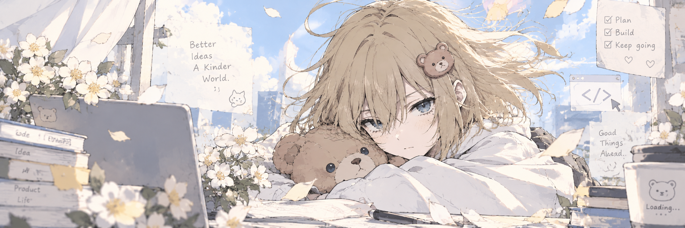

  

 

🌸 learning · building · creating · evolving 🩵

 

## 🌱 About me

Hi, I'm **wuxuan**.

A Computer Science student exploring the space between  
**AI, technology, products, and interesting ideas.**

I don't have everything figured out yet —  
I'm learning, building, experimenting, and evolving along the way.

 

## ✦ Currently

- 🌱 Learning more about AI
- 🧸 Building things from small ideas
- 💭 Exploring product & technology
- ✨ Trying, failing, learning, creating

 

### something is growing here... 🌱

`learning` · `building` · `creating` · `evolving`

 

come back later — maybe there'll be something new ✿

  

⋆｡°✩

**Thanks for stopping by :)**

